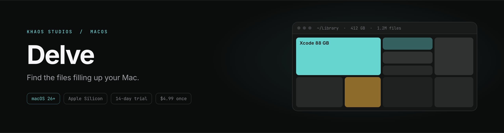

<div align="center">

<a href="https://khaosstudio.com/delve/">
  
</a>

<br>

[](https://github.com/snacbot/delve-releases/releases/latest)
[](https://github.com/snacbot/delve-releases/releases)
[](https://khaosstudio.com/delve/specs/)
[](https://khaosstudio.com/delve/specs/)
[](https://khaosstudio.com/delve/pricing/)

**[Download](https://github.com/snacbot/delve-releases/releases/latest/download/Delve.dmg)**
&nbsp;·&nbsp;
**[Website](https://khaosstudio.com/delve/)**
&nbsp;·&nbsp;
**[Pricing](https://khaosstudio.com/delve/pricing/)**
&nbsp;·&nbsp;
**[Specs](https://khaosstudio.com/delve/specs/)**
&nbsp;·&nbsp;
**[Release notes](https://github.com/snacbot/delve-releases/releases)**

</div>

---

## What Delve is

Delve maps a drive and draws the whole thing as one picture. Every file and folder becomes a tile sized by the space it takes, so whatever is eating your disk is simply the biggest thing on screen. Click a tile to go into it, hit space to preview it, and drop anything you want gone into the Collector. When you're finished poking around, the whole batch goes to the Trash in one action you can undo.

The part we spent the longest on is the part nobody advertises: being honest about size. APFS clones files, so macOS will happily report the same bytes two or three times, and most disk tools add it all up anyway. Delve shows logical size and what the data actually costs on disk side by side, and always tells you which number you're looking at. Hardlinks get counted once.

Nothing leaves your Mac. There's no account, no telemetry on your file names, and no server for any of it to go to.

## Install

**Homebrew**

```sh
brew install --cask snacbot/tap/delve
```

**Direct download**

1. Grab [`Delve.dmg`](https://github.com/snacbot/delve-releases/releases/latest/download/Delve.dmg) from the latest release.
2. Open the DMG and drag **Delve** into your **Applications** folder.
3. Launch it. Delve is signed and notarized by Apple, so it opens without a Gatekeeper warning.

Requires **macOS 26 or later** on Apple Silicon. Free for 14 days, then $4.99 once, updates included forever. See [pricing](https://khaosstudio.com/delve/pricing/) or the [full specs](https://khaosstudio.com/delve/specs/).

## What's in it

| | |
| --- | --- |
| **Treemap** | Cushioned squarified layout rendered in Metal. Pans and zooms at 60 Hz across two million tiles. |
| **Sunburst** | Pointer-anchored zoom with browser-style back and forward through your drill-downs. |
| **Honest sizes** | Logical vs. on-disk, with APFS clone and hardlink accounting. |
| **Extensions panel** | Per-type totals, so you can see that 40 GB of it is `.mov`. |
| **Quick Look** | Press space on any tile to preview the real file. |
| **Collector** | Stage items from any view, then Trash the batch in one undoable step. |
| **Poster export** | Save a scan as an image. People frame these, which we did not expect. |
| **Native chrome** | Liquid Glass, semantic colors, SF Symbols, light and dark. |

Longer writeups on how the scanner and renderer work are in the [build log](https://khaosstudio.com/delve/blog/), including [why counting bytes is harder than it sounds](https://khaosstudio.com/delve/blog/counting-bytes/).

## Updates

Delve updates itself through [Sparkle](https://sparkle-project.org). Once it's installed, new versions arrive in the background and you never need to come back here.

This repository is what makes that work. It hosts the appcast feed the app polls and the signed binaries it downloads.

| File | Purpose |
| --- | --- |
| [`appcast.xml`](appcast.xml) | The Sparkle update feed Delve checks for new versions |
| [Releases](https://github.com/snacbot/delve-releases/releases) | Each tag attaches the notarized, EdDSA-signed `Delve-<version>.dmg` |

Every build is compiled, signed, notarized, and published through the same automated pipeline. Each appcast entry carries an EdDSA signature that the app verifies before it installs anything.

## This repo

The **public release channel** for Delve: binaries and the update feed. The source is private.

Bug reports and feature requests are welcome in [Issues](https://github.com/snacbot/delve-releases/issues), or in [Discord](https://discord.gg/UxfhSWavbQ) if you'd rather just talk.

## More

- **Product page:** [khaosstudio.com/delve](https://khaosstudio.com/delve/)
- **Guides:** [disk full but space available](https://khaosstudio.com/delve/guides/disk-full-but-space-available/) and [others](https://khaosstudio.com/delve/guides/)
- **Comparisons:** [DaisyDisk](https://khaosstudio.com/delve/vs-daisydisk/), [GrandPerspective](https://khaosstudio.com/delve/vs-grandperspective/), [OmniDiskSweeper](https://khaosstudio.com/delve/vs-omnidisksweeper/), [CleanMyMac](https://khaosstudio.com/delve/cleanmymac-alternative/)
- **Volume licensing:** [khaosstudio.com/delve/enterprise](https://khaosstudio.com/delve/enterprise/)
- **Studio:** [Khaos Studios](https://khaosstudio.com) · [Privacy](https://khaosstudio.com/privacy.html) · [Terms](https://khaosstudio.com/terms.html) · [Refunds](https://khaosstudio.com/refund.html)

## License

Delve is proprietary software. Copyright 2026 Khaos Studios LLC. All rights reserved.
